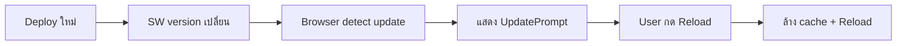

# 🔄 PWA Auto-Update System Guide

## 📋 สารบัญ
- [ภาพรวม](#ภาพรวม)
- [วิธีการทำงาน](#วิธีการทำงาน)
- [การ Deploy](#การ-deploy)
- [สำหรับ Developer](#สำหรับ-developer)
- [สำหรับ User](#สำหรับ-user)
- [Troubleshooting](#troubleshooting)

---

## 🎯 ภาพรวม

ระบบ Auto-Update นี้แก้ปัญหา **PWA cache** ที่ทำให้ user เห็น version เก่าหลัง deploy ใหม่

### ✨ Features

- ✅ **Auto-detect updates** - ตรวจจับ version ใหม่อัตโนมัติ
- ✅ **User-friendly prompt** - แจ้งเตือนให้ user reload
- ✅ **Smart caching** - HTML แบบ Network-First, Assets แบบ Cache-First
- ✅ **Version control** - ระบบ versioning ที่ชัดเจน
- ✅ **Works everywhere** - Desktop, Mobile, PWA

---

## 🔧 วิธีการทำงาน

### 1. **Service Worker Versioning**

```javascript
// public/service-worker.js
const CACHE_VERSION = 'voobize-20251106-1744';
```

- ใช้ **timestamp** เป็น version: `voobize-YYYYMMDD-HHmm`
- เมื่อ version เปลี่ยน → Browser ตรวจจับ SW ใหม่
- Cache เก่าถูกล้างอัตโนมัติ

### 2. **Caching Strategies**

| Resource Type | Strategy | เหตุผล |
|--------------|----------|--------|
| **HTML pages** | Network-First | Always fresh, ไม่ติด cache |
| **Images, Fonts** | Cache-First | Performance, ไม่เปลี่ยนบ่อย |
| **API calls** | No cache | ข้อมูลต้องเรียลไทม์ |

### 3. **Update Detection Flow**



### 4. **UpdatePrompt Component**

```tsx
// components/pwa/UpdatePrompt.tsx
- แสดงเมื่อมี version ใหม่
- ปุ่ม "อัปเดตเลย" → Reload ทันที
- ปุ่ม "ภายหลัง" → แสดงอีกครั้งใน 30 วินาที
```

---

## 🚀 การ Deploy

### Method 1: ใช้ Script อัตโนมัติ (แนะนำ)

```bash
# Update version + Build + Deploy
npm run deploy

# หรือแยกทำ
npm run update-sw    # อัปเดต version
npm run build        # Build
# จากนั้น deploy ด้วย Vercel/Netlify/etc
```

### Method 2: Manual Update

1. **แก้ไข `public/service-worker.js`**
   ```javascript
   // เปลี่ยนบรรทัดนี้
   const CACHE_VERSION = 'voobize-20251106-1744';

   // เป็น timestamp ปัจจุบัน
   const CACHE_VERSION = 'voobize-20251106-1830';
   ```

2. **Build & Deploy**
   ```bash
   npm run build
   # Deploy...
   ```

### ⚠️ สำคัญ!

- **ต้องเปลี่ยน version ทุกครั้งที่ deploy** ไม่งั้น cache ไม่ update
- ใช้ `npm run deploy` จะช่วยให้ไม่ลืม

---

## 👨‍💻 สำหรับ Developer

### การทดสอบ Auto-Update

#### 1. **Local Testing**

```bash
# Terminal 1: Run dev server
npm run dev

# Terminal 2: Simulate version change
npm run update-sw

# Reload browser → ควรเห็น UpdatePrompt
```

#### 2. **Production Testing**

1. Deploy version 1
2. เข้าชมเว็บ → จดเลข version จาก Console
3. Deploy version 2 (เปลี่ยน `CACHE_VERSION`)
4. Reload เว็บ → ควรเห็น UpdatePrompt

#### 3. **Debug Tips**

```javascript
// Chrome DevTools > Console
console.log('[SW] Current version:', CACHE_VERSION);

// Application > Service Workers
// - ดู status: "waiting to activate"
// - กด "skipWaiting" เพื่อ force update
// - กด "Unregister" เพื่อเริ่มใหม่

// Application > Storage
// - Clear storage เพื่อลบ cache ทั้งหมด
```

### การปรับแต่ง

#### เปลี่ยนเวลาแจ้งเตือนซ้ำ

```tsx
// components/pwa/UpdatePrompt.tsx
setTimeout(() => {
  setShowPrompt(true);
}, 30000); // 30 วินาที → เปลี่ยนตามต้องการ
```

#### เพิ่ม Assets ใน Precache

```javascript
// public/service-worker.js
const PRECACHE_ASSETS = [
  '/',
  '/logo.png',
  '/manifest.json',
  '/fonts/custom-font.woff2', // เพิ่มที่นี่
];
```

---

## 👥 สำหรับ User

### Desktop (Chrome/Edge/Firefox)

1. เปิดเว็บปกติ
2. เมื่อมี update → เห็น popup ด้านล่างขวา
3. กด **"อัปเดตเลย"** → หน้าจะ reload
4. เห็น version ใหม่ทันที ✅

### Mobile (Chrome/Safari)

1. เปิดเว็บปกติ
2. เมื่อมี update → เห็น notification ด้านล่าง (เหนือ bottom nav)
3. กด **"อัปเดตเลย"** → หน้าจะ reload
4. เห็น version ใหม่ทันที ✅

### PWA (Installed App)

1. เปิด PWA app
2. เมื่อมี update → เห็น prompt เหมือนเว็บ
3. กด **"อัปเดตเลย"** → app reload
4. ใช้ version ใหม่ได้เลย ✅

### การ Force Clear Cache (ถ้า Update ไม่ขึ้น)

#### Desktop:
1. เปิด DevTools (F12)
2. ไปที่ **Application** tab
3. **Service Workers** > กด **Unregister**
4. **Storage** > กด **Clear site data**
5. Reload (Ctrl+Shift+R)

#### Mobile Chrome:
1. ไปที่ **Settings** > **Site Settings** > **VOOBIZE**
2. กด **Clear & Reset**
3. กลับมาเปิดเว็บใหม่

#### Mobile Safari:
1. ไปที่ **Settings** > **Safari** > **Advanced** > **Website Data**
2. หา VOOBIZE แล้วกด **Remove**
3. กลับมาเปิดเว็บใหม่

#### PWA (Installed):
1. ถอน app ออก (Uninstall)
2. เปิดเว็บบน browser
3. ติดตั้ง PWA ใหม่

---

## 🐛 Troubleshooting

### ❌ ปัญหา: UpdatePrompt ไม่แสดง

**สาเหตุ:**
- Version ไม่ได้เปลี่ยน
- Service Worker ไม่ได้ register
- Browser ไม่รองรับ SW

**วิธีแก้:**
```bash
# 1. ตรวจสอบ version ใน SW file
cat public/service-worker.js | grep CACHE_VERSION

# 2. Force update version
npm run update-sw

# 3. Rebuild
npm run build

# 4. ตรวจสอบ SW registration
# Browser Console > Application > Service Workers
```

### ❌ ปัญหา: กด Update แล้วยังเห็น version เก่า

**สาเหตุ:**
- Multiple tabs เปิดอยู่
- Browser extension block reload
- Network cache

**วิธีแก้:**
1. ปิดทุก tabs ของเว็บ
2. เปิดใหม่ (incognito mode)
3. Hard reload (Ctrl+Shift+R)
4. Clear browser cache

### ❌ ปัญหา: Cache ไม่ถูกล้าง

**สาเหตุ:**
- `CACHE_VERSION` ไม่เปลี่ยน
- Activate event ไม่ทำงาน

**วิธีแก้:**
```javascript
// ตรวจสอบใน DevTools Console
navigator.serviceWorker.getRegistrations().then(regs => {
  regs.forEach(reg => {
    console.log('SW:', reg.active.scriptURL);
    reg.update(); // Force check update
  });
});
```

### ❌ ปัญหา: Script error ตอน npm run update-sw

**Error:**
```
CACHE_VERSION pattern not found
```

**วิธีแก้:**
- ตรวจสอบว่ามี `const CACHE_VERSION = 'voobize-YYYYMMDD-HHmm';` ใน SW file
- Format ต้องถูกต้อง (8 digits date + 4 digits time)

---

## 📚 เอกสารเพิ่มเติม

- [Service Worker API](https://developer.mozilla.org/en-US/docs/Web/API/Service_Worker_API)
- [PWA Caching Strategies](https://web.dev/offline-cookbook/)
- [Next.js PWA Guide](https://nextjs.org/docs/app/building-your-application/configuring/progressive-web-apps)

---

## 🎉 สรุป

### Workflow ที่แนะนำ

```bash
# 1. พัฒนา features
git add .
git commit -m "Add new feature"

# 2. Deploy
npm run deploy        # Auto update SW version + build
git push origin main

# 3. Deploy to hosting (Vercel/Netlify)
# Users จะเห็น UpdatePrompt อัตโนมัติ ✅
```

### Best Practices

1. ✅ ใช้ `npm run deploy` แทน `npm run build`
2. ✅ Test ใน incognito mode ก่อน deploy
3. ✅ ดู Console logs เพื่อ debug
4. ✅ แจ้ง users ให้ reload เมื่อ deploy major update
5. ✅ Monitor error logs (Sentry/LogRocket)

---

**Last Updated:** 2025-01-06
**Version:** 1.0.0
**Author:** VOOBIZE Team
